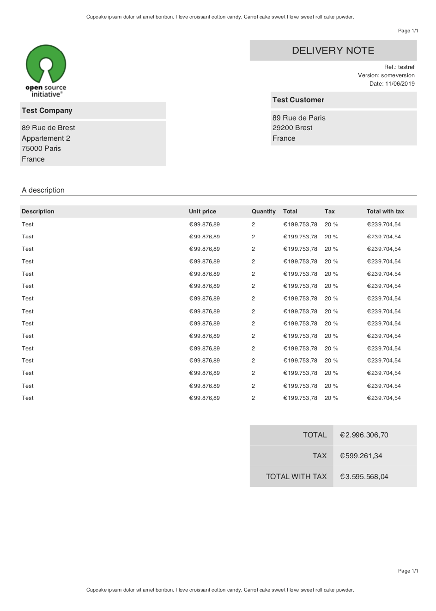

[](https://goreportcard.com/report/github.com/angelodlfrtr/go-invoice-generator)
[](https://godoc.org/github.com/angelodlfrtr/go-invoice-generator)

# Golang invoice generator

A super fast golang package to generate invoices, delivery notes and quotations as pdf
using https://github.com/go-pdf/fpdf.

## Download from Github

```
go get -u github.com/angelodlfrtr/go-invoice-generator
```

## Exemple output



## Quick start

```go
package main

import (
	"io/ioutil"
	"testing"

	generator "github.com/angelodlfrtr/go-invoice-generator"
)

func TestNew(t *testing.T) {
	doc, _ := generator.New(generator.Invoice, &generator.Options{
		TextTypeInvoice: "FACTURE",
		AutoPrint:       true,
	})

	doc.SetHeader(&generator.HeaderFooter{
		Text:       "<center>Cupcake ipsum dolor sit amet bonbon. I love croissant cotton candy. Carrot cake sweet I love sweet roll cake powder.</center>",
		Pagination: true,
	})

	doc.SetFooter(&generator.HeaderFooter{
		Text:       "<center>Cupcake ipsum dolor sit amet bonbon. I love croissant cotton candy. Carrot cake sweet I love sweet roll cake powder.</center>",
		Pagination: true,
	})

	doc.SetRef("testref")
	doc.SetVersion("someversion")

	doc.SetDescription("A description")
	doc.SetNotes("I love croissant cotton candy. Carrot cake sweet I love sweet roll cake powder! I love croissant cotton candy. Carrot cake sweet I love sweet roll cake powder! I love croissant cotton candy. Carrot cake sweet I love sweet roll cake powder! I love croissant cotton candy. Carrot cake sweet I love sweet roll cake powder! ")

	doc.SetDate("02/03/2021")
	doc.SetPaymentTerm("02/04/2021")

	logoBytes, _ := ioutil.ReadFile("./example_logo.png")

	doc.SetCompany(&generator.Contact{
		Name: "Test Company",
		Logo: &logoBytes,
		Address: &generator.Address{
			Address:    "89 Rue de Brest",
			Address2:   "Appartement 2",
			PostalCode: "75000",
			City:       "Paris",
			Country:    "France",
		},
	})

	doc.SetCustomer(&generator.Contact{
		Name: "Test Customer",
		Address: &generator.Address{
			Address:    "89 Rue de Paris",
			PostalCode: "29200",
			City:       "Brest",
			Country:    "France",
		},
	})

	for i := 0; i < 3; i++ {
		doc.AppendItem(&generator.Item{
			Name:        "Cupcake ipsum dolor sit amet bonbon, coucou bonbon lala jojo, mama titi toto",
			Description: "Cupcake ipsum dolor sit amet bonbon, Cupcake ipsum dolor sit amet bonbon, Cupcake ipsum dolor sit amet bonbon",
			UnitCost:    "99876.89",
			Quantity:    "2",
			Tax: &Tax{
				Percent: "20",
			},
		})
	}

	doc.AppendItem(&generator.Item{
		Name:     "Test",
		UnitCost: "99876.89",
		Quantity: "2",
		Tax: &Tax{
			Amount: "89",
		},
		Discount: &Discount{
			Percent: "30",
		},
	})

	doc.AppendItem(&generator.Item{
		Name:     "Test",
		UnitCost: "3576.89",
		Quantity: "2",
		Discount: &Discount{
			Percent: "50",
		},
	})

	doc.AppendItem(&generator.Item{
		Name:     "Test",
		UnitCost: "889.89",
		Quantity: "2",
		Discount: &Discount{
			Amount: "234.67",
		},
	})

	doc.SetDefaultTax(&generator.Tax{
		Percent: "10",
	})

	// doc.SetDiscount(&generator.Discount{
	// Percent: "90",
	// })
	doc.SetDiscount(&generator.Discount{
		Amount: "1340",
	})

	pdf, err := doc.Build()
	if err != nil {
		log.Fatal(err)
	}

	err = pdf.OutputFileAndClose("out.pdf")

	if err != nil {
		log.Fatal(err)
	}
}

```

## License

This SDK is distributed under the
[Apache License, Version 2.0](http://www.apache.org/licenses/LICENSE-2.0),
see [LICENSE](./LICENSE) and [NOTICE](./NOTICE) for more information.
