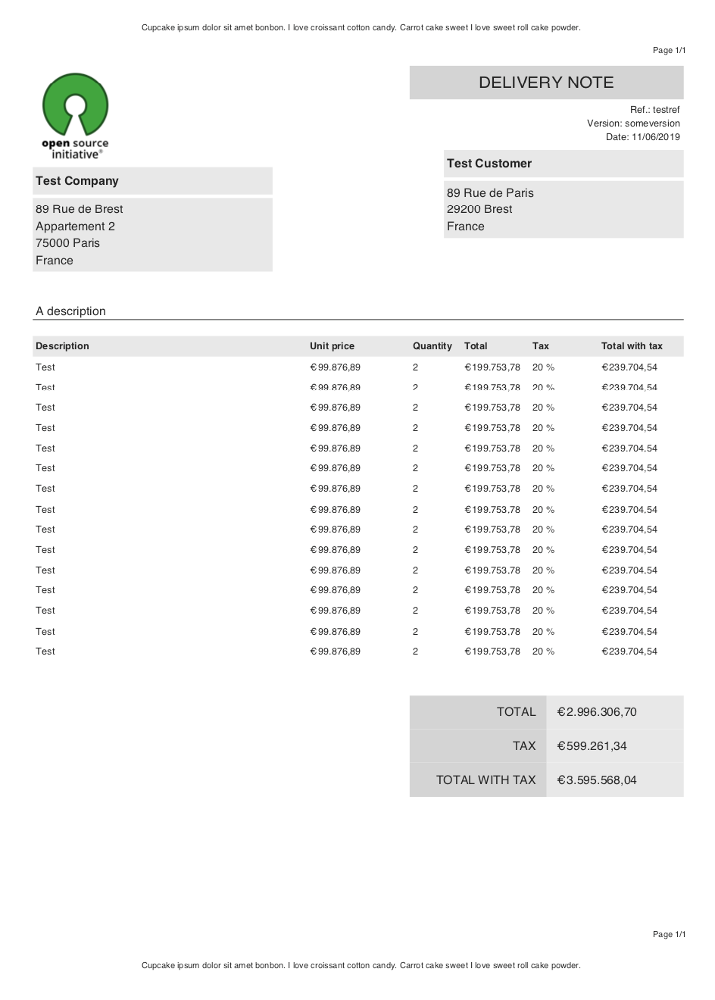

[](https://goreportcard.com/report/github.com/angelodlfrtr/go-invoice-generator)
[](https://godoc.org/github.com/angelodlfrtr/go-invoice-generator)

# go-invoice-generator

A Go package for generating **invoices**, **delivery notes**, and **quotations** as PDF files,
built on top of [go-pdf/fpdf](https://github.com/go-pdf/fpdf).

## Features

- Three document types: Invoice, Quotation, Delivery Note
- Per-item tax and discount (percentage or fixed amount)
- Document-level discount applied after item discounts
- Default tax applied automatically to items that have none
- Programmatic access to all totals (no need to build the PDF first)
- Custom header and footer with optional pagination
- Unicode support via a configurable translation function
- Fully customisable labels, colours, and currency formatting
- Output to file or `[]byte`

## Installation

```sh
go get github.com/angelodlfrtr/go-invoice-generator
```

## Quick start

```go
package main

import (
	"log"
	"os"

	generator "github.com/angelodlfrtr/go-invoice-generator"
)

func main() {
	doc, err := generator.New(generator.Invoice, &generator.Options{
		TextTypeInvoice: "INVOICE",
		CurrencySymbol:  "$ ",
	})
	if err != nil {
		log.Fatal(err)
	}

	doc.SetRef("INV-2024-001")
	doc.SetDate("01/01/2024")
	doc.SetPaymentTerm("01/02/2024")

	doc.SetCompany(&generator.Contact{
		Name: "Acme Corp",
		Address: &generator.Address{
			Address:    "1 Market Street",
			PostalCode: "94105",
			City:       "San Francisco",
			Country:    "USA",
		},
	})

	doc.SetCustomer(&generator.Contact{
		Name: "John Doe",
		Address: &generator.Address{
			Address:    "42 Main Street",
			PostalCode: "10001",
			City:       "New York",
			Country:    "USA",
		},
	})

	doc.AppendItem(&generator.Item{
		Name:     "Consulting",
		UnitCost: "150.00",
		Quantity: "8",
		Tax:      &generator.Tax{Percent: "20"},
	})

	pdf, err := doc.Build()
	if err != nil {
		log.Fatal(err)
	}

	if err := pdf.OutputFileAndClose("invoice.pdf"); err != nil {
		log.Fatal(err)
	}
}
```

## Example output



---

## Document types

| Constant                 | Value             |
| ------------------------ | ----------------- |
| `generator.Invoice`      | `"INVOICE"`       |
| `generator.Quotation`    | `"QUOTATION"`     |
| `generator.DeliveryNote` | `"DELIVERY_NOTE"` |

```go
doc, err := generator.New(generator.Quotation, &generator.Options{})
```

---

## Options

All fields are optional and have sensible defaults.

```go
doc, err := generator.New(generator.Invoice, &generator.Options{
	// Currency formatting
	CurrencySymbol:    "€ ",  // default: "€ "
	CurrencyPrecision: 2,     // default: 2
	CurrencyDecimal:   ".",   // default: "."
	CurrencyThousand:  " ",   // default: " "

	// Localised labels
	TextTypeInvoice:        "INVOICE",
	TextTypeQuotation:      "QUOTATION",
	TextTypeDeliveryNote:   "DELIVERY NOTE",
	TextRefTitle:           "Ref.",
	TextVersionTitle:       "Version",
	TextDateTitle:          "Date",
	TextPaymentTermTitle:   "Payment term",
	TextItemsNameTitle:     "Name",
	TextItemsUnitCostTitle: "Unit price",
	TextItemsQuantityTitle: "Qty",
	TextItemsTotalHTTitle:  "Total no tax",
	TextItemsTaxTitle:      "Tax",
	TextItemsDiscountTitle: "Discount",
	TextItemsTotalTTCTitle: "Total",
	TextTotalTotal:         "TOTAL",
	TextTotalDiscounted:    "TOTAL DISCOUNTED",
	TextTotalTax:           "TAX",
	TextTotalWithTax:       "TOTAL WITH TAX",

	// Colours (RGB)
	BaseTextColor: []int{35, 35, 35},
	GreyTextColor: []int{82, 82, 82},
	GreyBgColor:   []int{232, 232, 232},
	DarkBgColor:   []int{212, 212, 212},

	// Fonts (must be available to fpdf)
	Font:     "Helvetica",
	BoldFont: "Helvetica",

	// Automatically trigger the browser print dialog when the PDF is opened
	AutoPrint: false,
})
```

---

## Contacts

Both the company and the customer are `Contact` values. A logo can be embedded
as a `[]byte` (PNG or JPEG).

```go
logoBytes, err := os.ReadFile("logo.png")
if err != nil {
	log.Fatal(err)
}

doc.SetCompany(&generator.Contact{
	Name: "Acme Corp",
	Logo: logoBytes,
	Address: &generator.Address{
		Address:    "1 Market Street",
		Address2:   "Suite 200",          // optional second line
		PostalCode: "94105",
		City:       "San Francisco",
		Country:    "USA",
	},
	AddtionnalInfo: []string{         // extra lines printed below the address
		"VAT: FR12345678901",
		"SIRET: 123 456 789 00010",
	},
})

doc.SetCustomer(&generator.Contact{
	Name: "John Doe",
	Address: &generator.Address{
		Address:    "42 Main Street",
		PostalCode: "10001",
		City:       "New York",
		Country:    "USA",
	},
})
```

---

## Items

Each item has a name, optional description, unit cost, quantity, and optional
tax and discount.

```go
doc.AppendItem(&generator.Item{
	Name:        "Web development",
	Description: "Frontend and backend implementation",
	UnitCost:    "1200.00",
	Quantity:    "3",
	Tax:         &generator.Tax{Percent: "20"},
	Discount:    &generator.Discount{Percent: "10"},
})
```

`UnitCost` and `Quantity` are strings to avoid floating-point precision issues;
the library uses [shopspring/decimal](https://github.com/shopspring/decimal) internally.

### Tax

A tax is either a **percentage** or a **fixed amount** — not both.

```go
// 20% tax computed on the discounted item subtotal
Tax: &generator.Tax{Percent: "20"}

// Fixed €89 tax regardless of quantity
Tax: &generator.Tax{Amount: "89"}
```

### Discount

A discount is either a **percentage** or a **fixed amount** — not both.

```go
// 30% off the item subtotal
Discount: &generator.Discount{Percent: "30"}

// Fixed €50 deducted from the item subtotal
Discount: &generator.Discount{Amount: "50"}
```

---

## Default tax

`SetDefaultTax` applies a tax to every item that does not have its own `Tax` field.

```go
doc.SetDefaultTax(&generator.Tax{Percent: "20"})
```

Items that already have a `Tax` are not affected.

---

## Document-level discount

A document discount is applied to the subtotal after all item discounts. It
reduces both the pre-tax total and (proportionally) the tax due.

```go
// Fixed amount discount
doc.SetDiscount(&generator.Discount{Amount: "500"})

// Percentage discount
doc.SetDiscount(&generator.Discount{Percent: "5"})
```

---

## Totals

All totals are available programmatically after calling `Build()` (which runs
`Validate()` internally). You can also call `Validate()` directly if you only
need the numbers without generating a PDF.

```go
if err := doc.Validate(); err != nil {
	log.Fatal(err)
}

fmt.Println(doc.TotalWithoutTaxAndWithoutDocumentDiscount()) // sum of item subtotals after item discounts
fmt.Println(doc.TotalWithoutTax())                          // above minus document discount
fmt.Println(doc.Tax())                                      // total tax (respects document discount)
fmt.Println(doc.TotalWithTax())                             // final amount due
```

Item-level helpers are also available:

```go
item := &generator.Item{UnitCost: "100", Quantity: "2", Discount: &generator.Discount{Percent: "10"}}
if err := item.Prepare(); err != nil {
	log.Fatal(err)
}

fmt.Println(item.TotalWithoutTaxAndWithoutDiscount()) // 200.00
fmt.Println(item.TotalWithoutTaxAndWithDiscount())    // 180.00
fmt.Println(item.TaxWithTotalDiscounted())            // 0 (no tax set)
fmt.Println(item.TotalWithTaxAndDiscount())           // 180.00
```

---

## Header and footer

```go
doc.SetHeader(&generator.HeaderFooter{
	Text:       "<center>Acme Corp — Confidential</center>",
	FontSize:   7,
	Pagination: true, // show "Page X/{nb}" in the top-right corner
})

doc.SetFooter(&generator.HeaderFooter{
	Text:       "<center>Acme Corp · 1 Market Street · San Francisco</center>",
	Pagination: true,
})
```

`Text` supports basic HTML tags (`<b>`, `<i>`, `<center>`).

For full control you can provide a custom function directly on the underlying
fpdf instance:

```go
hf := &generator.HeaderFooter{UseCustomFunc: true}
hf.ApplyFunc(doc.Pdf(), func() {
	// use doc.Pdf() (a *fpdf.Fpdf) to draw anything you want
})
doc.SetHeader(hf)
```

---

## Unicode support

By default the document uses the `UnicodeTranslatorFromDescriptor("")` translator
bundled with fpdf. To use a different encoding (e.g. ISO-8859-2):

```go
import "github.com/go-pdf/fpdf/contrib/gofpdf"

translator := fpdf.UnicodeTranslatorFromDescriptor("iso-8859-2")
doc.SetUnicodeTranslator(translator)
```

---

## Output

**To a file:**

```go
pdf, err := doc.Build()
if err != nil {
	log.Fatal(err)
}
if err := pdf.OutputFileAndClose("out.pdf"); err != nil {
	log.Fatal(err)
}
```

**To a byte slice (e.g. for an HTTP response or S3 upload):**

```go
import "bytes"

pdf, err := doc.Build()
if err != nil {
	log.Fatal(err)
}

var buf bytes.Buffer
if err := pdf.Output(&buf); err != nil {
	log.Fatal(err)
}
// buf.Bytes() contains the PDF
```

---

## License

Distributed under the [Apache License, Version 2.0](http://www.apache.org/licenses/LICENSE-2.0).
See [LICENSE](./LICENSE) and [NOTICE](./NOTICE) for details.
