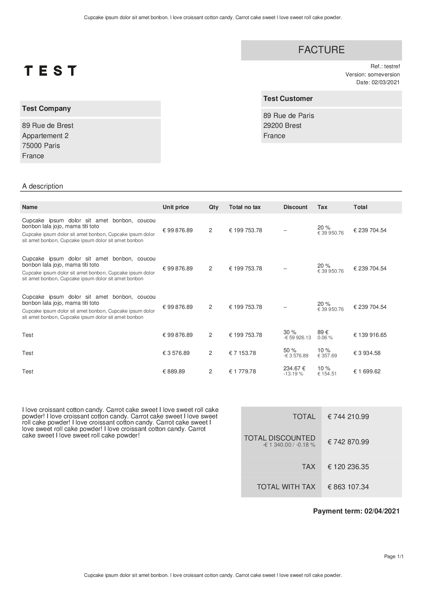

[](https://github.com/angelodlfrtr/go-invoice-generator/actions/workflows/ci.yml)
[](https://goreportcard.com/report/github.com/angelodlfrtr/go-invoice-generator)
[](https://godoc.org/github.com/angelodlfrtr/go-invoice-generator)

# go-invoice-generator

A Go package for generating **invoices**, **delivery notes**, and **quotations** as PDF files,
built on top of [go-pdf/fpdf](https://codeberg.org/go-pdf/fpdf).

## Features

- Three document types: Invoice, Quotation, Delivery Note
- Per-item tax and discount (percentage or fixed amount)
- Named taxes with per-name breakdown in the totals block
- Document-level discount applied after item discounts
- Default tax applied automatically to items that have none
- Programmatic access to all totals (no need to build the PDF first)
- Custom header and footer with optional pagination
- Unicode support via a configurable translation function
- Fully customisable labels, colours, and currency formatting
- Output to file or `[]byte`
- Roboto font embedded by default — no external font files required
- WIP / Experimental: Optional [Factur-X](#factur-x--wip--experimental) subpackage produces **PDF/A-3B** compliant e-invoices for all five profiles, verified with veraPDF and mustangproject

---

## v0.7.0 — Breaking Changes

The generator code has moved to the `generator` subpackage. Update your imports:

```diff
-import generator "github.com/angelodlfrtr/go-invoice-generator"
+import generator "github.com/angelodlfrtr/go-invoice-generator/generator"
```

The module path (`github.com/angelodlfrtr/go-invoice-generator`) is unchanged.

---

## Installation

```sh
go get github.com/angelodlfrtr/go-invoice-generator/generator
```

## Quick start

```go
package main

import (
	"log"
	"os"

	generator "github.com/angelodlfrtr/go-invoice-generator/generator"
)

func main() {
	doc, err := generator.New(generator.Invoice, &generator.Options{
		TextTypeInvoice: "INVOICE",
		CurrencySymbol:  "$ ",
	})
	if err != nil {
		log.Fatal(err)
	}

	doc.SetRef("INV-2024-001")
	doc.SetDate("01/01/2024")
	doc.SetPaymentTerm("01/02/2024")

	doc.SetCompany(&generator.Contact{
		Name: "Acme Corp",
		Address: &generator.Address{
			Address:    "1 Market Street",
			PostalCode: "94105",
			City:       "San Francisco",
			Country:    "USA",
		},
	})

	doc.SetCustomer(&generator.Contact{
		Name: "John Doe",
		Address: &generator.Address{
			Address:    "42 Main Street",
			PostalCode: "10001",
			City:       "New York",
			Country:    "USA",
		},
	})

	doc.AppendItem(&generator.Item{
		Name:     "Consulting",
		UnitCost: "150.00",
		Quantity: "8",
		Tax:      &generator.Tax{Percent: "20"},
	})

	pdf, err := doc.Build()
	if err != nil {
		log.Fatal(err)
	}

	if err := pdf.OutputFileAndClose("invoice.pdf"); err != nil {
		log.Fatal(err)
	}
}
```

## Example output



---

## Document types

| Constant                 | Value             |
| ------------------------ | ----------------- |
| `generator.Invoice`      | `"INVOICE"`       |
| `generator.Quotation`    | `"QUOTATION"`     |
| `generator.DeliveryNote` | `"DELIVERY_NOTE"` |

```go
doc, err := generator.New(generator.Quotation, &generator.Options{})
```

---

## Options

All fields are optional and have sensible defaults.

```go
doc, err := generator.New(generator.Invoice, &generator.Options{
	// Currency formatting
	CurrencySymbol:    "€ ",  // default: "€ "
	CurrencyPrecision: 2,     // default: 2
	CurrencyDecimal:   ".",   // default: "."
	CurrencyThousand:  " ",   // default: " "

	// Localised labels
	TextTypeInvoice:        "INVOICE",
	TextTypeQuotation:      "QUOTATION",
	TextTypeDeliveryNote:   "DELIVERY NOTE",
	TextRefTitle:           "Ref.",
	TextVersionTitle:       "Version",
	TextDateTitle:          "Date",
	TextPaymentTermTitle:   "Payment term",
	TextItemsNameTitle:     "Name",
	TextItemsUnitCostTitle: "Unit price",
	TextItemsQuantityTitle: "Qty",
	TextItemsTotalHTTitle:  "Total no tax",
	TextItemsTaxTitle:      "Tax",
	TextItemsDiscountTitle: "Discount",
	TextItemsTotalTTCTitle: "Total",
	TextTotalTotal:         "Total",
	TextTotalDiscounted:    "Total discounted",
	TextTotalTax:           "Tax",
	TextTotalTaxOther:      "Other",  // label for unnamed taxes in breakdown (default: "Other")
	TextTotalWithTax:       "Total with tax",

	// Colours (RGB)
	BaseTextColor: []int{35, 35, 35},
	GreyTextColor: []int{82, 82, 82},
	GreyBgColor:   []int{232, 232, 232},
	DarkBgColor:   []int{212, 212, 212},

	// Font family name. Roboto is embedded and used by default; any font
	// registered on the underlying fpdf instance can be used here.
	Font:     "Roboto",  // default: "Roboto"
	BoldFont: "Roboto",  // default: "Roboto"
})
```

---

## Contacts

Both the company and the customer are `Contact` values. A logo can be embedded
as a `[]byte` (PNG or JPEG).

```go
logoBytes, err := os.ReadFile("logo.png")
if err != nil {
	log.Fatal(err)
}

doc.SetCompany(&generator.Contact{
	Name: "Acme Corp",
	Logo: logoBytes,
	Address: &generator.Address{
		Address:    "1 Market Street",
		Address2:   "Suite 200",          // optional second line
		PostalCode: "94105",
		City:       "San Francisco",
		Country:    "USA",
	},
	AddtionnalInfo: []string{         // extra lines printed below the address
		"VAT: FR12345678901",
		"SIRET: 123 456 789 00010",
	},
})

doc.SetCustomer(&generator.Contact{
	Name: "John Doe",
	Address: &generator.Address{
		Address:    "42 Main Street",
		PostalCode: "10001",
		City:       "New York",
		Country:    "USA",
	},
})
```

---

## Items

Each item has a name, optional description, unit cost, quantity, and optional
tax and discount.

```go
doc.AppendItem(&generator.Item{
	Name:        "Web development",
	Description: "Frontend and backend implementation",
	UnitCost:    "1200.00",
	Quantity:    "3",
	Tax:         &generator.Tax{Percent: "20"},
	Discount:    &generator.Discount{Percent: "10"},
})
```

`UnitCost` and `Quantity` are strings to avoid floating-point precision issues;
the library uses [shopspring/decimal](https://github.com/shopspring/decimal) internally.

### Tax

A tax is either a **percentage** or a **fixed amount** — not both. An optional `Name`
groups taxes in the totals breakdown.

```go
// 20% VAT
Tax: &generator.Tax{Percent: "20", Name: "VAT 20%"}

// Reduced 5.5% VAT
Tax: &generator.Tax{Percent: "5.5", Name: "VAT 5.5%"}

// Fixed €89 eco-tax regardless of quantity
Tax: &generator.Tax{Amount: "89", Name: "Eco tax"}

// Unnamed — grouped under "Other" in the breakdown
Tax: &generator.Tax{Percent: "10"}
```

When two or more distinct tax names are present the totals block shows the overall
tax amount (same as before) followed by a smaller per-name breakdown. Taxes without a
name are grouped under the label set by `Options.TextTotalTaxOther` (default: `"Other"`).

### Discount

A discount is either a **percentage** or a **fixed amount** — not both.

```go
// 30% off the item subtotal
Discount: &generator.Discount{Percent: "30"}

// Fixed €50 deducted from the item subtotal
Discount: &generator.Discount{Amount: "50"}
```

---

## Default tax

`SetDefaultTax` applies a tax to every item that does not have its own `Tax` field.

```go
doc.SetDefaultTax(&generator.Tax{Percent: "20"})
```

Items that already have a `Tax` are not affected.

---

## Document-level discount

A document discount is applied to the subtotal after all item discounts. It
reduces both the pre-tax total and (proportionally) the tax due.

```go
// Fixed amount discount
doc.SetDiscount(&generator.Discount{Amount: "500"})

// Percentage discount
doc.SetDiscount(&generator.Discount{Percent: "5"})
```

---

## Totals

All totals are available programmatically after calling `Build()` (which runs
`Validate()` internally). You can also call `Validate()` directly if you only
need the numbers without generating a PDF.

```go
if err := doc.Validate(); err != nil {
	log.Fatal(err)
}

fmt.Println(doc.TotalWithoutTaxAndWithoutDocumentDiscount()) // sum of item subtotals after item discounts
fmt.Println(doc.TotalWithoutTax())                          // above minus document discount
fmt.Println(doc.Tax())                                      // total tax (respects document discount)
fmt.Println(doc.TotalWithTax())                             // final amount due
```

Item-level helpers are also available:

```go
item := &generator.Item{UnitCost: "100", Quantity: "2", Discount: &generator.Discount{Percent: "10"}}
if err := item.Prepare(); err != nil {
	log.Fatal(err)
}

fmt.Println(item.TotalWithoutTaxAndWithoutDiscount()) // 200.00
fmt.Println(item.TotalWithoutTaxAndWithDiscount())    // 180.00
fmt.Println(item.TaxWithTotalDiscounted())            // 0 (no tax set)
fmt.Println(item.TotalWithTaxAndDiscount())           // 180.00
```

---

## Header and footer

```go
doc.SetHeader(&generator.HeaderFooter{
	Text:       "<center>Acme Corp — Confidential</center>",
	FontSize:   7,
	Pagination: true, // show "Page X/{nb}" in the top-right corner
})

doc.SetFooter(&generator.HeaderFooter{
	Text:       "<center>Acme Corp · 1 Market Street · San Francisco</center>",
	Pagination: true,
})
```

`Text` supports basic HTML tags (`<b>`, `<i>`, `<center>`).

For full control you can provide a custom function directly on the underlying
fpdf instance:

```go
hf := &generator.HeaderFooter{UseCustomFunc: true}
hf.ApplyFunc(doc.Pdf(), func() {
	// use doc.Pdf() (a *fpdf.Fpdf) to draw anything you want
})
doc.SetHeader(hf)
```

---

## Unicode support

By default the document uses the `UnicodeTranslatorFromDescriptor("")` translator
bundled with fpdf.
To use a different encoding (e.g. ISO-8859-2), check `examples/iso_8859_2_cp`.

---

## Output

**To a file:**

```go
pdf, err := doc.Build()
if err != nil {
	log.Fatal(err)
}
if err := pdf.OutputFileAndClose("out.pdf"); err != nil {
	log.Fatal(err)
}
```

**To a byte slice (e.g. for an HTTP response or S3 upload):**

```go
import "bytes"

pdf, err := doc.Build()
if err != nil {
	log.Fatal(err)
}

var buf bytes.Buffer
if err := pdf.Output(&buf); err != nil {
	log.Fatal(err)
}
// buf.Bytes() contains the PDF
```

---

## Factur-X — WIP / Experimental

The `facturx` subpackage embeds a [Factur-X](https://fnfe-mpe.org/factur-x/) (also known as ZUGFeRD 2.x) compliant CII XML into the PDF produced by `Build()`. All five conformance levels are supported and validated with mustang-cli and veraPDF (PDF/A-3B). In addition to the XML attachment, `Attach` automatically:

- Sets `/AFRelationship /Alternative` on the embedded file, as required by PDF/A-3.
- Inserts an sRGB ICC OutputIntent into the PDF catalog (pure Go, no external dependencies).
- Merges the required Factur-X `pdfaid`, `pdfaExtension`, and `fx:` XMP declarations into the PDF's existing XMP packet without discarding fields written by fpdf (Producer, CreationDate, etc.).

```sh
go get github.com/angelodlfrtr/go-invoice-generator/facturx
```

```go
import (
    "bytes"

    generator "github.com/angelodlfrtr/go-invoice-generator/generator"
    "github.com/angelodlfrtr/go-invoice-generator/facturx"
)

// 1. Build the PDF as usual.
pdf, err := doc.Build()
if err != nil {
    log.Fatal(err)
}

var buf bytes.Buffer
if err := pdf.Output(&buf); err != nil {
    log.Fatal(err)
}

// 2. Attach the Factur-X XML and bring the document into PDF/A-3b conformance.
result, err := facturx.Attach(buf.Bytes(), doc, facturx.Options{
    Profile:           facturx.ProfileEN16931,
    SellerTaxID:       "FR12345678901",
    SellerCountryCode: "FR",
    BuyerCountryCode:  "US",
    CurrencyCode:      "EUR",
    PaymentDueDate:    "20240201",
    PaymentIBAN:       "FR7630006000011234567890189",
    PaymentBIC:        "BNPAFRPP",
})
if err != nil {
    log.Fatal(err)
}

// result contains the PDF/A-3b document with the embedded factur-x.xml attachment.
os.WriteFile("invoice_facturx.pdf", result, 0644)
```

### Profiles

| Constant                  | Factur-X profile | Line items in XML |
| ------------------------- | ---------------- | ----------------- |
| `facturx.ProfileMinimum`  | MINIMUM          | No                |
| `facturx.ProfileBasicWL`  | BASIC-WL         | No                |
| `facturx.ProfileBasic`    | BASIC            | Yes               |
| `facturx.ProfileEN16931`  | EN 16931         | Yes               |
| `facturx.ProfileExtended` | EXTENDED         | Yes               |

### Options

| Field                 | Type    | Description                                                                         |
| --------------------- | ------- | ----------------------------------------------------------------------------------- |
| `Profile`             | Profile | Conformance level (default: `ProfileMinimum`)                                       |
| `CurrencyCode`        | string  | ISO 4217 code (default: `"EUR"`)                                                    |
| `SellerTaxID`         | string  | Seller VAT registration number (e.g. `"FR12345678901"`)                             |
| `SellerCountryCode`   | string  | ISO 3166-1 alpha-2 seller country code (e.g. `"FR"`); falls back to address country |
| `BuyerCountryCode`    | string  | ISO 3166-1 alpha-2 buyer country code (e.g. `"US"`); falls back to address country  |
| `BuyerReference`      | string  | Buyer's internal reference (e.g. a purchase order number)                           |
| `BuyerTaxID`          | string  | Buyer VAT registration number (rendered for BASIC-WL and above)                     |
| `PaymentDueDate`      | string  | Payment due date in `"YYYYMMDD"` format                                             |
| `PaymentIBAN`         | string  | Seller IBAN for bank transfer                                                       |
| `PaymentBIC`          | string  | Seller BIC/SWIFT code                                                               |
| `PaymentMeansCode`    | string  | UN/ECE 4461 payment means code (default: `"58"` when IBAN is set)                   |
| `TaxCategoryCode`     | string  | Default VAT category code — `"S"` standard, `"E"` exempt, `"Z"` zero-rated          |
| `TypeCode`            | string  | UN/CEFACT type code (default: `"380"` invoice; `"381"` credit note)                 |
| `ItemDefaultUnitCode` | string  | UN/ECE Rec 20 unit code for all line items (default: `"C62"` piece/unit)            |
| `ShowIcon`            | bool    | Place the Factur-X profile icon in the bottom-right corner of the first page        |

---

## License

Distributed under the [Apache License, Version 2.0](http://www.apache.org/licenses/LICENSE-2.0).
See [LICENSE](./LICENSE) and [NOTICE](./NOTICE) for details.
